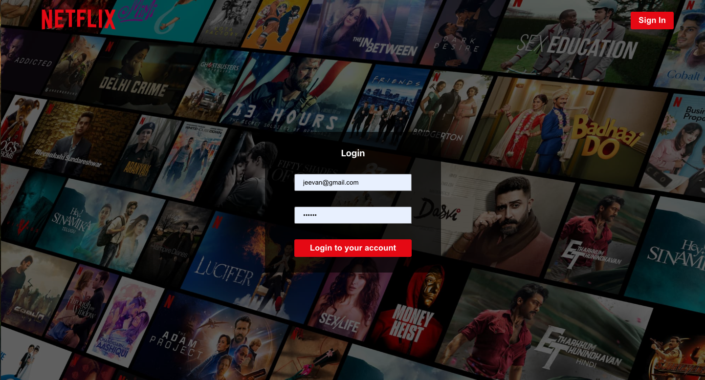

Netflix Recreation

✅ Project description  
✅ Features  
✅ Screenshots placeholder  
✅ Technologies used  
✅ Detailed setup instructions (including all commands)  
✅ Firebase & MongoDB configuration  
✅ Project structure  
✅ Contact info  

```markdown
# 📺 Netflix Recreation (Full Stack App)

A complete **Netflix Recreation** built with **React**, **Firebase**, **Express**, and **MongoDB**. Users can register, log in, browse movies, and save their favorite ones to their "Liked List".

## 📸 Screenshots

### 🔐 Login Page  


### 📝 Signup Page  


### 🏠 Home Page  


### 🔥 Trending Movies  


## 🚀 Features

- 🔐 Firebase Email/Password Authentication  
- 🧾 Liked Movies stored in MongoDB  
- 🎬 Movie browsing experience with TMDB API  
- 💻 Responsive UI using Styled Components  
- 🛡️ Protected Routes with React Router  
- 🌈 Modern design inspired by Netflix


## 🧰 Tech Stack

**Frontend:** React, Firebase, Styled Components, TMDB API  
**Backend:** Node.js, Express, MongoDB (Mongoose)  
**Other:** Dotenv, React Router, Axios


## ⚙️ Setup Instructions

> 💡 Ensure you have **Node.js**, **npm**, and **MongoDB** installed locally.

### 🔁 Step 1: Recreation the Repository

```bash
git Recreation https://github.com/shresthajeevan/Netflix-Recreation.git
cd Netflix-Recreation
```


### 🧩 Step 2: Setup Backend (Express + MongoDB)

```bash
cd server
npm install
```

Create a `.env` file inside `/server`:

```
MONGO_URL=mongodb://localhost:27017/netflix
```

Run the backend server:

```bash
node index.js
```

> You should see: `server started on port 5000` and `DB Connection Successful`


### 🧑‍🎨 Step 3: Setup Frontend (React + Firebase)

```bash
cd ../client
npm install
```

Inside `client/src/utils/firebase-config.js`, paste your Firebase config:

```javascript
import { initializeApp } from "firebase/app";
import { getAuth } from "firebase/auth";

const firebaseConfig = {
  apiKey: "YOUR_API_KEY",
  authDomain: "YOUR_AUTH_DOMAIN",
  projectId: "YOUR_PROJECT_ID",
  storageBucket: "YOUR_STORAGE_BUCKET",
  messagingSenderId: "YOUR_MSG_ID",
  appId: "YOUR_APP_ID",
};

const app = initializeApp(firebaseConfig);
export const firebaseAuth = getAuth(app);
```

> 🔐 Replace all values with your Firebase project's settings from the console.

Run the React app:

```bash
npm start
```

It should open at `http://localhost:3000`.


## 🔐 Firebase Setup

1. Go to [Firebase Console](https://console.firebase.google.com/)
2. Create a new project
3. Go to **Authentication → Sign-in Method → Enable Email/Password**
4. Copy Firebase config and paste into `firebase-config.js`


## 🧪 MongoDB Setup

Update your `.env` with:

```env
MONGO_URL=mongodb://localhost:27017/netflix
```

## 👤 Author

**Jeevan Shrestha**  
📧 [shresthajeevan889@gmail.com]  
🔗 [LinkedIn: https://www.linkedin.com/in/jeevan-shrestha/]
   [Portfolio: https://shresthajeevan.github.io/]


## 🌟 Star This Repo

If you found this project helpful or inspiring, please give it a ⭐ on GitHub!

```
